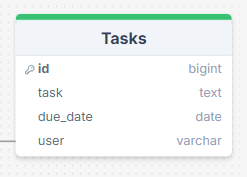

# Project: Able Investigation and Enforcements Ltd Web Application (Title: AbleCase)

## Overview
The Able Investigation and Enforcements Ltd web application aims to streamline case management, invoicing, and payment processes for the company. This document provides an overview of the project, its key features, and implementation details.

## Scope
In as this will be submitted for an assignmet there will be trade offs against the design and development process. Any additonal features classified as low importance can be revisitted at a later date. Using the AGILE method for development, I will carry out weekly reviews both personally and with the client to add or modify features as applicable to the project at the end of each sprint phase.

## Key Features
After the initial disscussion with the client, I have listed out each key feature for the project and assigned each an importance and feasibility score to help avoid scope creep and secure a MVP by the deadline.

1. **Case File Management**
   - Create new case files for clients, capturing and storing case-specific information.
   - Search case files based of specific criteria like client or case number.
   - Organize case files for easy retrieval and management.
   - Update case files with any on going communication history specific to the case.

2. **Client Management**
   - Create new clients.
   - Edit and Update client details.
   - Delete Clients from the system.

3. **User Management**
   - Create new users.
   - Set user permissions with application specific permission levels.
     (e.g. View/Edit case files, View/Edit client detials).
   - Edit user details.
   - Block and allow access to the platform.
   - Change own password.
   - Add and track tasks.
   
4. **Invoice Generation and Management**
   - Generate invoices from case files.
   - Include detailed breakdowns of services provided and costs.
   - Manage invoice lifecycle, including tracking payment status.

5. **Online Payment Portal for Clients and Customers**
   - Allow clients to view and pay invoices securely online.
   - Support multiple payment methods such as credit/debit cards and bank transfers.
   - Ensure compliance with industry standards for payment processing.

6. **Report Management**
   - Create audit reports for tracking updates to clients.
   - Create audit reports for tracking updates to cases.
   - Create audit reports for tracking updates to invoices.

## Importance / Feasibility score
**1** - Low, **5** - High   

| Feature | Importance | Feasibility |
|---------|------------|-----------|
| Create new case files for clients, capturing and storing case-specific information. | 5 | 5 |
| Search case files based of specific criteria like client or case number. | 5 | 5 |
| Organize case files for easy retrieval and management. | 4 | 4 |
| Update case files with any on going communication history specific to the case. | 5 | 4 |
| Create new clients. | 5 | 5 |
| Edit and Update client details. | 5 | 5 |
| Delete Clients from the system. | 3 | 5 |
| Create new users. | 5 | 5 |
| Set user permissions with application specific permission levels. | 3 | 3 |
| Edit user details. | 5 | 5 |
| Block and allow access to the platform. | 5 | 4 |
| Change own password. | 3 | 4 |
| Add and track tasks. | 2 | 4 |
| Generate invoices from case files. | 4 | 4 |
| Include detailed breakdowns of services provided and costs. | 3 | 3 |
| Manage invoice lifecycle, including tracking payment status. | 4 | 3 |
| Allow clients to view and pay invoices securely online. | 5 | 5 |
| Support multiple payment methods such as credit/debit cards and bank transfers. | 3 | 3 |
| Ensure compliance with industry standards for payment processing. | 5 | 5 |
| Create audit reports for tracking updates to clients. | 2 | 3 |
| Create audit reports for tracking updates to casess. | 2 | 3 |
| Create audit reports for tracking updates to invoices. | 2 | 3 |

## Implementation Details
### Technologies Used
- Django framework for backend development
- HTML/CSS/JavaScript for frontend development
- PostgreSQL database for data storage
- Stripe API for payment processing

### Development Process
1. **Setup and Configuration**
   - Create Django project and application structure.
   - Configure project settings, including database settings and security measures.
   - Set up virtual environment for dependency management.

2. **Case File Management**
   - Define Django models for case files and client details.
   - Develop views and templates for CRUD operations on case files.
   - Implement forms for capturing and validating user input.

3. **Invoice Generation and Management**
   - Design models for invoices and invoice line items.
   - Create views and templates for generating and managing invoices.
   - Integrate with PDF generation library for generating PDF invoices.

4. **Payment Integration**
   - Integrate with Stripe API for processing online payments.
   - Develop views and forms for handling payment transactions.
   - Ensure secure communication and data handling during payment processing.

5. **User Authentication and Authorization**
   - Implement user authentication and authorization mechanisms.
   - Define user roles and permissions for accessing different features.
   - Secure sensitive data and endpoints to prevent unauthorized access.

6. **Report Management**
   - Create view to pull update and created records for client, cases and invoices.
   - Implement search and filter requests.
   - Create templates to show each of the required reports.

6. **Testing and Quality Assurance**
   - Conduct unit tests and integration tests for each feature.
   - Perform manual testing to validate user workflows and edge cases.
   - Address any bugs or issues identified during testing.

7. **Deployment and Maintenance**
   - Deploy the application to a reliable hosting environment.
   - Configure monitoring and logging to track application performance.
   - Establish procedures for ongoing maintenance and support.

## User Stories
### As a user
   > I want a clear view of all the case files and wether they are open or closed. I want to be able to access each case in as few clicks as possible, and easily create and update case files as needed.

### As a user
   > I want to be able to create and modify user accounts, and set the required access levels for that user.

### As a user
   > I want to be able to generate an invoice from a case file, and edit the invoices as required. I want to be able to easily view and change the status of an invoice.

### As a customer
   > I want to be able to make a payment for any fines or notices without having to create an account.

### As a customer
   > I want to be able to create an account to keep track of any fines or notices, along with any payments I have made or need to make.

### As a customer
   > I want to be able to easily pay for an invoice and recieve an email reciept.

## Conclusion
The Able Investigation and Enforcements Ltd web application will provide a comprehensive solution for managing cases, generating invoices, and processing payments efficiently. By leveraging Django and other technologies, the application will streamline operations and enhance customer satisfaction.

## Structure
### Overview

### Dashboard (app)
   - Dashboard (page): Overview of current open cases and stats, current tasks for user.

### Case management (app)
   - Cases (page): List of cases showing current status (Open/Closed)
   - Case details (page): Create a or edit details of a case. Can add and view case communications.
   - Case Communications (page): Record of all communications relating to the case. Can search and filter.

### Client Management (app)
   - Client details (page): Create or edit the main details of each client along with login details for customer portal.

### User Management (app)
   - Users (page): List of users
   - User details (page): Create or edit users and permissions.

### Invoice Management (app)
   - Invoices (page): List of invoices, with search and filter options.
   - Invoice details (page): Create or edit an invoice.

### Customer Portal (app)
   - Profile (page): Edit details and change password.
   - Invoices (page): All invoices specific to the customer.
   - Payments (page): Make a payment.

## Models & Schema
The following database models and schema were drawn in [DrawSQL](https://drawsql.app), and an embedded link to the full database schema with comments can be found [here](https://drawsql.app/teams/dan-54/diagrams/ablecase/embed).

### Database Overview

### Tables
#### Clients

#### Cases

#### Communications

#### Case Types

#### Users

#### Tasks

#### Invoices

#### Invoice Codes

#### Payments

